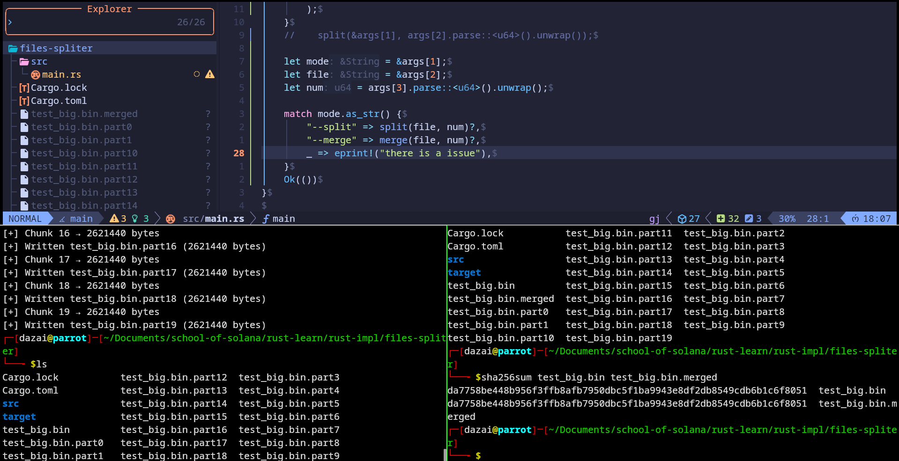

# File Splitter & Merger



A simple and efficient command-line tool written in Rust for splitting large files into smaller chunks and merging them back together.

## Features

- **Split**: Divide large files into a specified number of equal-sized chunks
- **Merge**: Reconstruct the original file from split parts
- **Fast & Reliable**: Written in Rust for maximum performance and safety
- **Checksum Verification**: Original and merged files maintain identical SHA-256 checksums

## Installation

### Prerequisites
- Rust toolchain (install from [rustup.rs](https://rustup.rs))

### Build from Source

```bash
git clone <your-repo-url>
cd splitter
cargo build --release
```

The compiled binary will be available at `target/release/splitter`

## Usage

### Split a File

```bash
cargo run -- --split <filename> <number_of_chunks>
```

**Example:**
```bash
cargo run -- --split test_big.bin 20
```

**Output:**
```
file part-size: 2621440
reminder part-size: 0
file-size: 52428800
[+] Chunk 0 → 2621440 bytes
[+] Written test_big.bin.part0 (2621440 bytes)
[+] Chunk 1 → 2621440 bytes
[+] Written test_big.bin.part1 (2621440 bytes)
...
```

This creates files named: `test_big.bin.part0`, `test_big.bin.part1`, etc.

### Merge Split Files

```bash
cargo run -- --merge <base_filename> <number_of_chunks>
```

**Example:**
```bash
cargo run -- --merge test_big.bin 20
```

**Output:**
```
[+] Merged test_big.bin.part0
[+] Merged test_big.bin.part1
[+] Merged test_big.bin.part2
...
[+] Final output: test_big.bin.merged
```

### Verify Integrity

You can verify that the split and merge process preserved the file perfectly using SHA-256:

```bash
sha256sum test_big.bin test_big.bin.merged
```

**Example Output:**
```
da7758be448b956f3ffb8afb7950dbc5f1ba9943e8df2db8549cdb6b1c6f8051  test_big.bin
da7758be448b956f3ffb8afb7950dbc5f1ba9943e8df2db8549cdb6b1c6f8051  test_big.bin.merged
```

## How It Works

### Splitting
1. Reads the input file size
2. Calculates the size of each chunk by dividing total size by number of chunks
3. Handles remainder bytes by adding them to the last chunk
4. Writes each chunk to a separate file with `.part<N>` extension

### Merging
1. Reads all part files in sequence (`.part0`, `.part1`, etc.)
2. Concatenates their contents into a single output file
3. Creates a merged file with `.merged` extension

## Use Cases

- Splitting large files for email attachments or file transfer limits
- Distributing large datasets across multiple storage locations
- Creating backup archives that fit specific size constraints
- Working around file size limitations on certain platforms

## Technical Details

- **Language**: Rust
- **Dependencies**: Standard library only
- **File I/O**: Buffered reading/writing for efficiency
- **Error Handling**: Proper Result types with `io::Result` returns

## Command-Line Arguments

| Argument | Description |
|----------|-------------|
| `--split` | Mode to split a file into chunks |
| `--merge` | Mode to merge chunks back into a file |
| `<filename>` | Path to the input file |
| `<chunks>` | Number of chunks to split into or merge from |

## License

[Add your license here]

## Contributing

Contributions are welcome! Please feel free to submit a Pull Request.

## Author

Created by [@0xshivaay](https://x.com/0xshivaay)